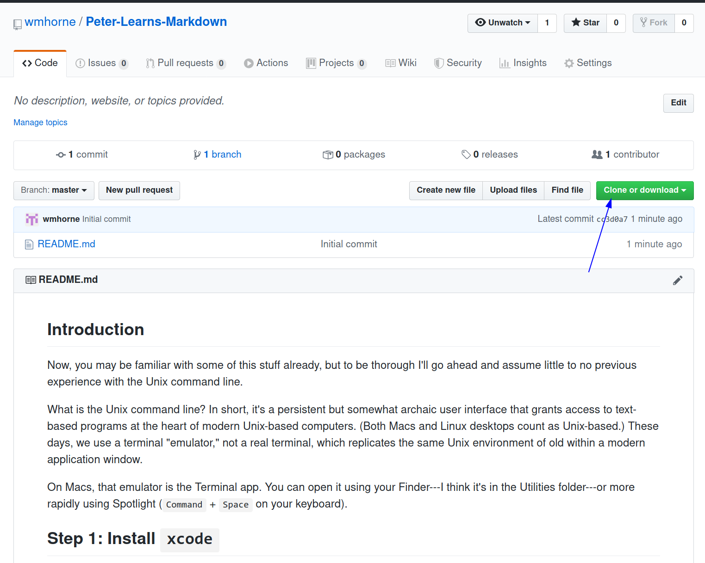

## Introduction

You may be familiar with some of this stuff already, but to be thorough I'll go
ahead and assume little to no previous experience with the Unix command line.

What is the Unix command line? It's a persistent but somewhat archaic user
interface that grants access to text-based programs at the heart of modern
Unix-based computers (meaning Macs, Linux desktops, BSDs, and so forth). These
days, you use a "terminal emulator" rather than a real terminal to issue these
commands, but at its core the emulator is a replica of the same Unix environment
that was built into the tiny and slow computers people hunched over in the 70s,
80s, and 90s.


On Macs, that emulator is Terminal.app. You can open it using your Finder---I
think it's in the Utilities subfolder of the "Applications"---or more
rapidly using Spotlight (`Command` + `Space` on your keyboard).

## Step 1: Install `xcode`

If you've never used command line utilities on your Mac before, the first step
will be to install
[xcode](https://apps.apple.com/us/app/xcode/id497799835?mt=12&ign-mpt=uo%3D4),
the collection of developer tools available from Apple.

To install xcode, copy `xcode-select --install` into Terminal and press Enter.
As I recall, this can take a while.

## Step 2: Install Package Manager (Homebrew)

Once you have that finished, you'll be well served to install a "package
manager," a program that will itself allow you to download and install
other programs without too much fuss. Since there is no standard Mac package
manager, you'll probably need [Homebrew](https://brew.sh/), the "Missing Package
Manager for macOS."

To install Homebrew, paste the following into the Terminal app and press Enter.

```
/bin/bash -c "$(curl -fsSL https://raw.githubusercontent.com/Homebrew/install/master/install.sh)"
```

## Step 3: Install git

You're reading this on Github. That works fine. But given that you'll ultimately
want to work with files within your own local filesystem, it makes sense to
transfer these instructions there.

Rather than download them in the standard way (by clicking a download link, for
example), copying and pasting their contents into new files, you'll use git to
clone them onto your machine. Git is a version control system that is useful if
not essential to writing in plain text formats like markdown and latex, and it's
also simply everywhere in development today and therefore useful to know.

(Unrelatedly, its creation is fascinating in its own right. Linus Torvalds,
frustrated with the version control software available to him as he was
developing Linux, decided to created his own. He started on April 3rd, 2005. The
project was released April 7th, just four days later. Beginning as something he
created for his own work, the program has gone on to facilitate the development
of almost every major software platform built within the last twenty years.
Facebook, Twitter, Google, Netflix, and LinkedIn are just some of the companies
and projects listed as Git users on [its website](https://git-scm.com/). There
are undoubtedly more.)

Now that you have Homebrew, installing git is as easy as running the following in Terminal:

`brew install git`

Once git is installed, you'll need to register your name and email. Copy the
following into the terminal, replacing "your name" with... you get the idea.

```
git config --global user.name "Your name"
```

Do the same with your email:

```
git config --global user.email "Your email address"
```

Git should be ready to go.

## Step 4: Clone this git repository

To get a copy of this file on your computer, you'll want to clone the whole
repository. A repository is a selection of files that git has been told to watch
for changes, which in this case includes this file and a folder with a few
screenshots.

Since I created this Github repository, I can tell you the link with which to
clone the repo. It's `https://github.com/wmhorne/Peter-Learns-Markdown.git`.
It's worth knowing how to clone any Github repository, though.

Above and to the right of this or any Github README page (a README page being
effectively the "front page" of any Github project), you'll see a green button
that says, "Clone or download." That button will reveal the same link I just
pasted above. It's actually the same link you'll find in the browser's url bar,
but that doesn't really add much here.

Here is the button to which I've referred:


Now, if you were to clone the repository right now, it would end up in what's
called your home folder. Your home folder is sort of the default folder that
contains the important directories you use daily. Your Documents folder is in
your home folder; your Music folder is in your home folder; your Desktop is in
your home folder. Others, like Dropbox, Google Drive, Pictures, etc., are in
your home folder too. In terms of importance and size, a folder called
"Peter-Learns-Markdown" doesn't really belong next to "Documents". Instead, you
likely want it nested somewhere inside one of those bigger folders, like
`Documents/Software/Peter-Learns-Markdown`.

#### Directories and Some Basic Unix Commands

Let me back up a step. In a terminal, you are always in a directory. The
tecnhical term for this is that you always have a "Present Working Directory"
whenever you're in a terminal. You can change what this PWD is, but it's always
something. By default, that Present Working Directory is your home folder.

In your terminal, type the command that tells you what your Present Working
Directory is, `pwd`. 

By default is `/home/william`, my home folder. I don't know what yours will be,
but I'd bet it would be `/home/peter`. Anyway, whatever you see when you `pwd`
inside a new terminal, that's your home folder.

Now, I'll note something here that was very helpful for me when I was learning
some of this stuff, and it's this: The directories you'll be working in while in
the terminal, as well as the files you with which you'll work, are the same
exact set of directories and files you see in Finder. Same files, same folders,
same structure; they are just presentated differently. 

To test this, open Finder. In your menu bar (the bar at the top of the screen),
click "Go", then "Home." (The latter might be called "peter," but I think it's
called "Home.") This should open Finder in your Home folder. What do you see?
Probably something like this: 


Go back to your terminal. Type the command that lists the files and folders in
your present working directory, 

```
ls
```

You will see the same files and folders listed as you see in your finder.

If you type 

```
touch abc.txt
```

into your terminal, you should see


When you open your terminal, it opens up inside your home
directory. This means that, inside a fresh terminal, any command you run will
run inside your home folder. Any files it affects and/or creates, therefore,
will also be located there, and we've just established that you don't want that.

The technical way of saying this is that, by default,  `Present Working Directory`, the
directory in which your terminal commands will (by defauly) take effect. When
you open up a terminal, this is your home folder. 

Given that you want to work  a different folder, you will need to change
directories, something you can accomplish with the command `cd`.

If you run `cd Documents`, this will change your Present Working Directory to
Documents. Running `cd Desktop` instead would have changed your Present Working
Directory to Desktop. And so on.

If you `c.` (thats two periods, `.` and `.`, following a space) will bring you
back one folder.

`cd Music` brings you into Music. `cd ..` brings you back into your home folder.

When you want to know where you are, you can type the command to tell you your
Present Working Directory, `pwd`. This command is like asking, "Where am I?"
When I `pwd` in a new terminal, I am told I am in `/home/william`, which is my
home folder. (Coincidentally, if you want to know who you are (in the computer's
eyes), you can type `whoami`. The result ought to be your name. If that doesn't
work---which it might not, since I've just read that whoami has become obsolete
on Macs---try running the command, `id -un`.)

Anyway, `pwd` tells you where you are, `cd` moves you into the directory you
specify, and `cd ..` brings you one folder back.

Go ahead and relocate yourself in your home folder. If you can't get back into
your home folder, you can always close the terminal and open the application
again. New terminals open in your home folder unless you've set them to do
otherwise.

From your home folder, `cd` into "Documents"


Importantly, you'll want to clone this repository into the correct place on your
computer. You don't necessarily want it in your "home" folder Instead you'll
want to put it wherever you think it should go. Maybe that's in "Documents."
Maybe that's in "Dropbox." That's up to you.

Copy that link. Then, in the terminal, type

```
git clone
```

and paste that link.

```
git clone https://github.com/wmhorne/Peter-Learns-Markdown.git
```


## Acquanit yourself with markdown

## Download pandoc

## Download Latex
